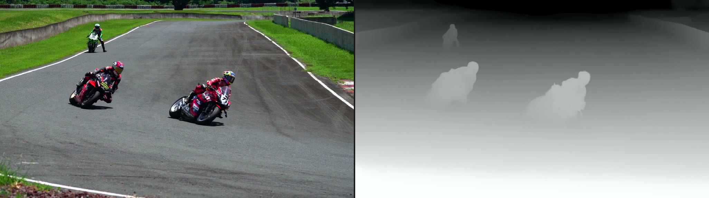
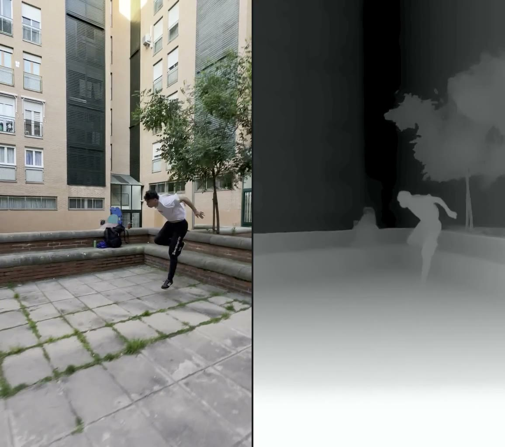

# LiteDepth

English | [简体中文](README.zh.md)

[](#)
[](LICENSE)
[](#)

A lightweight, standalone CLI tool that turns any standard video into temporally smooth grayscale depth maps—running entirely on CPU without requiring GPUs, Python virtual environments, or CUDA drivers.

Most monocular depth estimation tools require complex Python environments, heavy PyTorch installations, and NVIDIA CUDA dependencies. LiteDepth embeds both the inference engine and model weights directly into a single native binary, letting you generate depth videos with a single command on standard laptops and servers.

<p align="center">
  
  
</p>

Check out dynamic video comparisons on the [demo site](https://akacoder.github.io/LiteDepth/).

---

## Highlights

- 🖥️ **CPU-Only Inference** — Runs completely on CPU. No NVIDIA GPUs, CUDA toolkits, or specialized hardware required.
- 📦 **Single Self-Contained Binary** — Depth Anything V2 Small weights and ONNX Runtime are bundled directly into the executable. Zero Python or pip dependencies.
- 🎞️ **Temporally Coherent Depth** — Built-in multi-stage temporal smoothing and tone mapping suppress the flicker and edge jitter typical of per-frame monocular depth estimation.

---

## Installation

### Pre-built Binaries (Recommended)

Download the standalone binary for your platform directly from GitHub Releases:

| OS / Architecture | Binary Name |
| --- | --- |
| **macOS** (Apple Silicon) | `litedepth-darwin-arm64` |
| **Linux** (x86_64) | `litedepth-linux-amd64` |
| **Linux** (ARM64) | `litedepth-linux-arm64` |
| **Windows** (x86_64) | `litedepth-windows-amd64.exe` |

*Filenames remain consistent across releases, providing stable direct download URLs for the latest builds.*

> **macOS Compatibility**: Pre-built binaries are provided for Apple Silicon only. Upstream ONNX Runtime discontinued official Intel (x86_64) macOS libraries starting with v1.24.

> **External Dependency**: LiteDepth relies on `ffmpeg` and `ffprobe` for video decoding and encoding. If they are not found in your `PATH`, LiteDepth will prompt you to automatically download verified static builds to `~/.litedepth/bin/`.

---

## Quick Start

**Export a full depth video**:
```bash
./litedepth clip.mp4
```
Generates `clip.depth.mp4` in the same directory. Closer objects appear brighter and distant objects darker (0–255), with the long edge automatically capped at 1024px while preserving audio tracks and the original frame rate.

**Generate a side-by-side preview sheet**:
```bash
./litedepth --preview clip.mp4
```
Uniformly samples keyframes across the clip, generates an RGB vs. depth comparison sheet (`clip.depth.preview.jpg`), and immediately opens it in your default image viewer (default: 3 frames).

**Process only the first few seconds**:
```bash
./litedepth --duration 5 clip.mp4
```
Processes only the first 5 seconds to quickly evaluate depth quality and motion coherence.

> **Performance Note**: Monocular depth estimation on CPU is compute-intensive; processing a few seconds of video typically takes several minutes. We recommend testing with `--preview` or `--duration` before processing full-length videos.

---

## Command-Line Options

| Flag | Description |
| --- | --- |
| `--preview` | Generate and automatically open a side-by-side keyframe comparison sheet (default: 3 frames). |
| `--preview-frames <N>` | Number of sampled keyframes for the preview (1–12; automatically enables preview mode). |
| `--duration <sec>` | Limit processing to the first N seconds of the video. |
| `--frames` | Save individual depth maps as a PNG sequence alongside the video (ignored when `--preview` is enabled). |
| `--output <path>` | Custom destination path for the output video or preview image. |

**Configure CLI Language**:
```bash
./litedepth setup
```
Select your preferred CLI language (English / 简体中文). Your choice is saved to `~/.litedepth/config.json`. If unset, LiteDepth automatically defaults to your system locale.

---

## Building from Source

### Prerequisites

1. **Go 1.25+**
2. **C Compiler** (required for CGO):
   - macOS: Xcode Command Line Tools (`xcode-select --install`)
   - Linux: `gcc`
   - Windows: MinGW-w64 `gcc` added to `PATH`
3. **FFmpeg & FFprobe**

### Build Steps

```bash
# 1. Download embedded model weights and platform-specific ONNX Runtime libraries
go run ./scripts/fetchdeps

# 2. Compile
go build -o litedepth ./cmd/litedepth
# Windows:
# go build -o litedepth.exe ./cmd/litedepth
```

---

## Tech Stack & Credits

- Model: [Depth Anything V2 Small](https://github.com/DepthAnything/Depth-Anything-V2)
- Inference Runtime: [ONNX Runtime](https://onnxruntime.ai/) via [onnxruntime_go](https://github.com/yalue/onnxruntime_go)
- Media Processing: [FFmpeg](https://ffmpeg.org/)

## License

Released under the [Apache-2.0](LICENSE) License.
